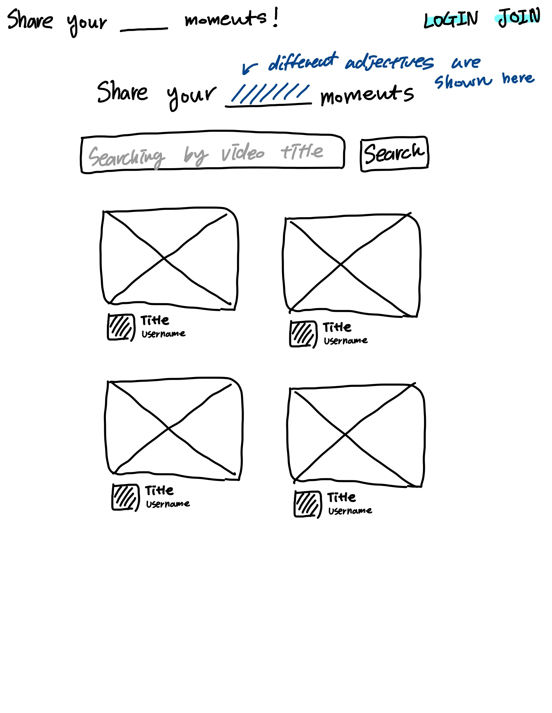
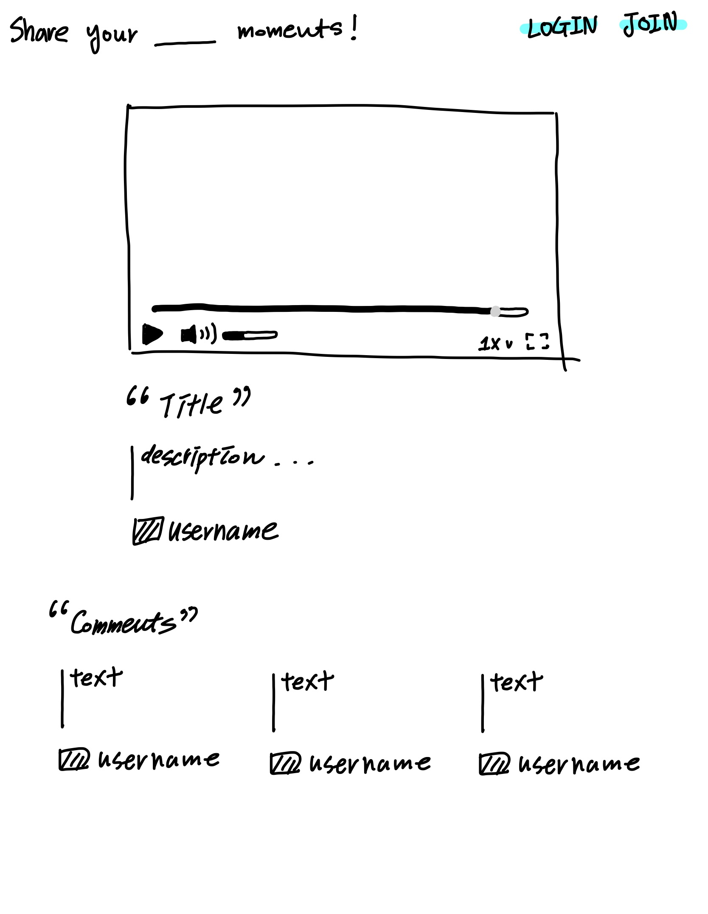
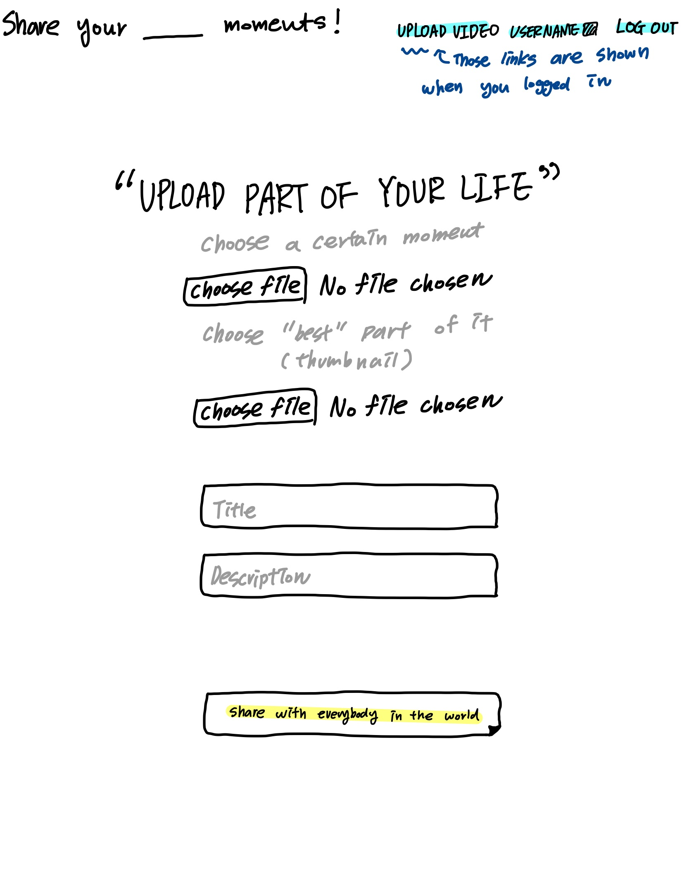
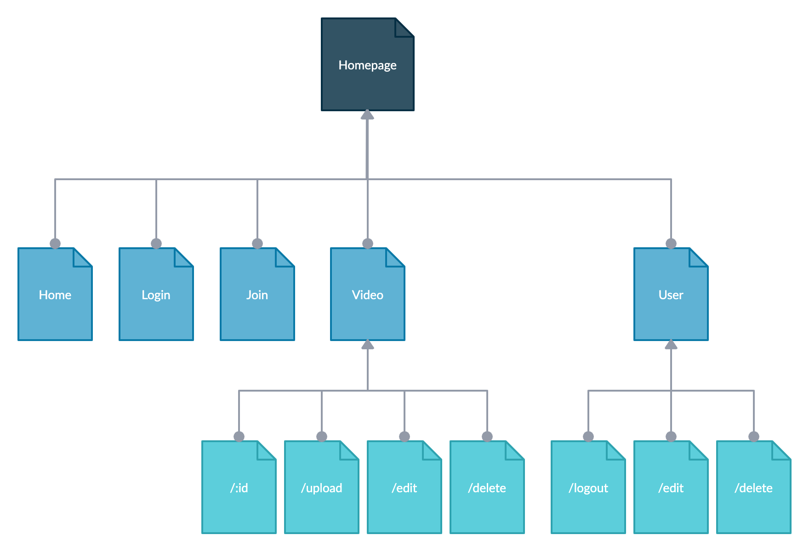

Web Application where users can upload and share their videos
• Designed front-end with website wireframe and built it with Webpack, Sass, ESLint, and AJAX
• Applied Express.js and MongoDB to build a server-side backend and utilized MongoDB Atlas and AWS for clouding service
• Implemented bcrypt hashing algorithm to authenticate the users and apply session to store user information

The content below is an example project proposal / requirements document. Replace the text below the lines marked "**TODO**" with details specific to your project. Remove the "TODO" lines.

(**TODO**: your project name\_)

# Share your \_\_\_\_\_ moments!

[Link to my project](https://share-your-blank-moments.herokuapp.com/)

## Overview

(**TODO**: a brief one or two paragraph, high-level description of your project\_)

Do you have any moments you want to keep forever? or moments that you want to share with anybody or everybody else? That's why Share your lovely moments are created!

Share your lovely moments! is a web app that allow users to post their video and share with other users. Uers can register and login. Once they're logged in, they can upload or edit their video and share that with others users.

On top of that, you can comments other users' videos and even check how many people check your videos too.

## Data Model

(**TODO**: a description of your application's data and their relationships to each other\_)

The application will store Users, Comments and Videos

- users can have multiple comments and videos (via references and by embedding)
- each video can have multiple comments (via references and by embedding)

(**TODO**: sample documents\_)

An Example User with Embedded Videos:

```javascript
{
  username: "wonderfulMoments",
  hash: // a password hash,
  // an array of references to Videos documents
  videos: [
    {videoSchema},
    {videoSchema},
  ]
}
```

An Example Videos with Embedded Items:

```javascript
{
  owner: // a reference to a User object,
  title: "Crushed on him",
  fileUrl: //file URL,
  description: "The first moment that I met him",
  createdAt: // timestamp,
}
```

## [Link to Commented First Draft Schema](db.js)

(**TODO**: create a first draft of your Schemas in db.js and link to it\_)

## Wireframes

(**TODO**: wireframes for all of the pages on your site; they can be as simple as photos of drawings or you can use a tool like Balsamiq, Omnigraffle, etc.\_)

/ - homepage that shows all video and searching page



/video/:id - page for watching target video



/video/upload - page for uploading video (Only registered users can access this page)



## Site map

(**TODO**: draw out a site map that shows how pages are related to each other\_)

Here's a sample example of site map:



## User Stories or Use Cases

(**TODO**: write out how your application will be used through [user stories](http://en.wikipedia.org/wiki/User_story#Format) and / or [use cases](https://www.mongodb.com/download-center?jmp=docs&_ga=1.47552679.1838903181.1489282706#previous)\_)

1. as non-registered user, I can register a new account with the site
2. as non-registered user, I can watch videos
3. as a user, I can log in to the site
4. as a user, I can edit or delete my profile
5. as a user, I can upload a video
6. as a user, I can edit a video
7. as a user, I can delete a video

## Research Topics

(**TODO**: the research topics that you're planning on working on along with their point values... and the total points of research topics listed\_)

- (3 points) Use Webpack
  - Webpack is a static module bundler for modern JavaScript applications
  - To gather all your dependencies, which includes not just code, but other assets as well, and generate a dependency graph
  - Search about what it is and why we use this more deeply and how I can use this
- (2 points) Integrate ESLint into my workflow
  - ESLint is a static code analysis tool for identifying problematic patterns found in JavaScript code.
  - To make code more consistent and avoiding bugs.
  - Search about what it is and why we use this more deeply and how I can use this
- (2 points) Use a CSS preprocesse - Sass
  - Sass (short for syntactically awesome style sheets) is a preprocessor scripting language that is interpreted or compiled into Cascading Style Sheets (CSS).
  - To use things like variables, nested rules, inline imports and more
  - Search about what it is and why we use this more deeply and how I can use this
- (2 points) Heroku + MongoDB
- (3 points) use AWS to save my file

8+ points total out of 8 required points (**\_TODO**: addtional points will **not** count for extra credit\_)

## [Link to Initial Main Project File](app.js)

(**TODO**: create a skeleton Express application with a package.json, app.js, views folder, etc. ... and link to your initial app.js\_)

## Annotations / References Used

(**TODO**: list any tutorials/references/etc. that you've based your code off of\_)

1. [tutorial on webpack](https://webpack.js.org/guides/) - (add link to source code that was based on this)
2. [tutorial on sass](https://sass-lang.com/guide) - (add link to source code that was based on this)
